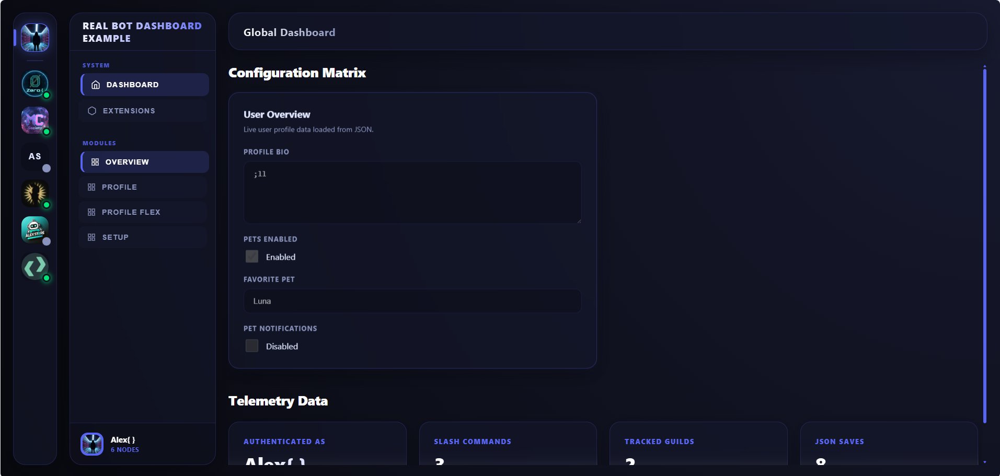

# 🎨 Templates & Design Guide

This package includes beautiful, responsive, built-in UI templates and fully supports custom HTML/CSS template renderers for ultimate flexibility.

## ✨ Built-in Templates

We ship with three meticulously crafted layouts out of the box. Simply change the `uiTemplate` and `uiTheme` properties in your configuration to switch between them.

### 1) `default` (Recommended)

- **Aesthetic:** Modern, futuristic "Floating Island" / Bento Box design.
- **Features:** Glassmorphism backdrop blurs, separated floating panels, and a sleek dark-space Blurple theme.
- **Best for:** Premium bots that want a standout, native-app feel.



### 2) `shadcn-magic`

- **Aesthetic:** Clean, minimalist glassmorphism centered around a main "Shell".
- **Features:** Horizontal server strip navigation, radial background glows, and high-contrast borders.
- **Best for:** Bots aiming for a highly trendy, clean-web aesthetic (inspired by modern React libraries).


### 3) `compact`

- **Aesthetic:** Denser, utility-first layout.
- **Features:** Tighter visual spacing, reduced padding, and a classic deep-dark Discord theme.
- **Best for:** Information-heavy dashboards or complex configuration matrices.


---

## ⚙️ How Template Selection Works

Template resolution is strictly typed and handled seamlessly by the core engine:

1. **TypeScript Validation:** The `uiTemplate` property only accepts valid built-in keys (`"default" | "compact" | "shadcn-magic"`) or a custom renderer function.
2. **Resolution:** The engine reads `uiTemplate` from your options (defaults to `"default"`).
3. **Custom Override:** If a custom function is provided via the `uiTemplates` object mapping, it overrides the built-in renderer.
4. **Theme Matching:** Don't forget to pair your `uiTemplate` with the matching `uiTheme` for the intended color palette!

---

## 💻 Usage Example

Changing the template is as simple as updating two strings in your adapter options:

```ts
import express from "express";
import { Client, GatewayIntentBits } from "discord.js";
import { createExpressAdapter } from "@developer.krd/discord-dashboard";

const app = express();
const client = new Client({ intents: [GatewayIntentBits.Guilds] });

const dashboard = createExpressAdapter({
  app,
  client,
  botToken: process.env.BOT_TOKEN!,
  clientId: process.env.CLIENT_ID!,
  clientSecret: process.env.CLIENT_SECRET!,
  redirectUri: "http://localhost:3000/dashboard/callback",
  sessionSecret: process.env.SESSION_SECRET!,

  // Switch your layout here:
  uiTemplate: "shadcn-magic",
  uiTheme: "shadcn-magic",
});
```

---

## 🛠️ Custom Templates

If you want complete control over the HTML structure, you can write your own renderer function. The engine will pass you a `DashboardTemplateRenderContext` containing the safe dashboard name, base path, and theme config.

```ts
import express from "express";
import { Client } from "discord.js";
import { createExpressAdapter, type DashboardTemplateRenderer } from "@developer.krd/discord-dashboard";

const app = express();
const client = new Client({ intents: [] });

// 1. Define your custom HTML layout
const myCustomTemplate: DashboardTemplateRenderer = (context) => {
  return `
    <!doctype html>
    <html lang="en">
    <head>
        <title>${context.dashboardName}</title>
        <style>
            body { background: #111; color: white; font-family: sans-serif; }
            .cursor-pointer { cursor: pointer; }
        </style>
    </head>
    <body>
        <h1>Welcome to ${context.dashboardName}</h1>
        <button class="cursor-pointer" onclick="alert('Hello!')">Click Me</button>
        
        <script>
            window.dashboardConfig = { basePath: "${context.basePath}" };
        </script>
    </body>
    </html>`;
};

// 2. Pass it to the adapter
const dashboard = createExpressAdapter({
  app,
  client,
  // ... credentials ...

  // Pass the function directly to uiTemplate
  uiTemplate: myCustomTemplate,
});
```


